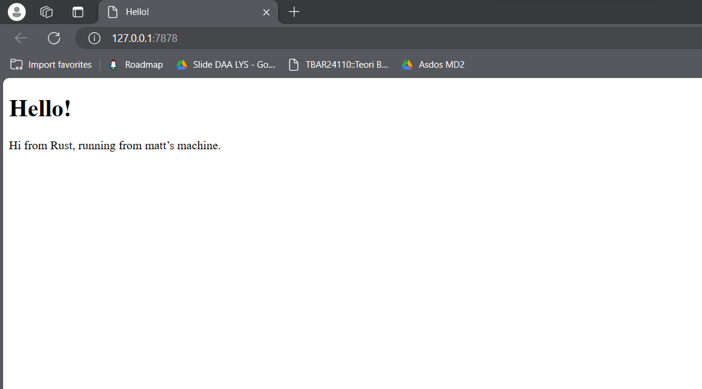
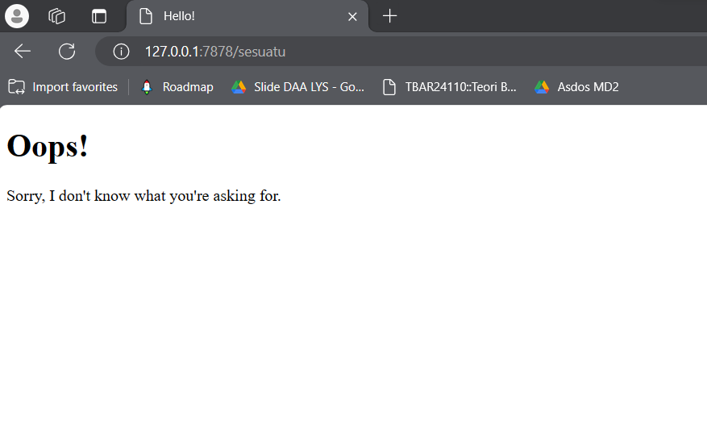

# Tutorial Module 6

```
Nama    : Matthew Hotmaraja Johan Turnip
NPM     : 2206081231
Kelas   : B
```

1. Commit 1 - handle_connection function

   ```
   fn handle_connection(mut stream: TcpStream) {
       let buf_reader = BufReader::new(&mut stream);
       let http_request: Vec<_> = buf_reader
           .lines()
           .map(|result| result.unwrap())
           .take_while(|line| !line.is_empty())
           .collect();

       println!("Request: {:#?}", http_request);
   }
   ```

   Dari apa yang saya baca dari [dokumentasi Rust](https://doc.rust-lang.org/book/ch20-01-single-threaded.html), `handle_connection` adalah fungsi yang digunakan untuk menangani koneksi ke server. Pada awalnya, fungsi tersebut membuat *instance* baru dari `BufReader` yang membungkus referensi *mutable* ke `stream`. Selanjutnya, *function* menggunakan variabel `http_request` untuk mengumpulkan baris-baris *request* yang dikirimkan oleh browser ke server.

    Selanjutnya, *method* `lines()` yang disediakan oleh `BufReader` mengembalikan iterator dari `Result<String, std::io::Error>`. Setelah itu, kita mengumpulkan baris-baris permintaan dari iterator tersebut. Browser menandai akhir dari permintaan HTTP dengan mengirimkan dua karakter baris baru (*new line*) berturut-turut. Jadi, kita mengambil baris-baris sampai kita mendapatkan baris yang kosong. Dengan demikian, `handle_connection` bertanggung jawab untuk membaca permintaan HTTP dari stream, dan mengelolanya.

2. Commit 2 - Returning HTML
    

    Beberapa tambahan kode terlihat setelah variabel `http_request`. Terdapat variabel `status_line` untuk status dari *request*. Lalu, program mebaca file `hello.html` menggunakan `fs::read_to_string` dan menyimpannya ke variable `contents`. Ada juga variable `length` untuk panjang dari variabel `contents`. Selanjutnya, respon akan disimpan ke variabel `response`. `format!` akan digunakan untuk konten file sebagai *response body*. 

    `http_request` akan di-*ignore* sehingga semua *request* akan diterima dan akan mengembalikan *file* `hello.html`, artinya *request* `127.0.0.1:7878/sesuatu` juga akan mengembalikan respon yang sama.

3. Commit 3 - Validating request and selectively responding
   
    
    Sebelumnya, semua *request* akan diterima dan program akan mengembalikan file `hello.html`. Oleh karena itu, pada *commit* ini saya memisahkan *response* tergantung *request*-nya.

    Pertama-tama, saya menambahkan block *if-else* untuk mengecek *request*:
    ```
    fn handle_connection(mut stream: TcpStream) {
    let buf_reader = BufReader::new(&mut stream);
    let request_line = buf_reader.lines().next().unwrap().unwrap();

    if request_line == "GET / HTTP/1.1" {
        let status_line = "HTTP/1.1 200 OK";
        let contents = fs::read_to_string("hello.html").unwrap();
        let length = contents.len();

        let response = format!(
            "{status_line}\r\nContent-Length: {length}\r\n\r\n{contents}"
        );

        stream.write_all(response.as_bytes()).unwrap();
    } else {
        let status_line = "HTTP/1.1 404 NOT FOUND";
        let contents = fs::read_to_string("404.html").unwrap();
        let length = contents.len();

        let response = format!(
            "{status_line}\r\nContent-Length: {length}\r\n\r\n{contents}"
        );

        stream.write_all(response.as_bytes()).unwrap();
    }
    ```

    Pada kode tersebut, program akan mengecek apakah *request*-nya `GET / HTTP/1.1`, lalu merespon sesuai *request* tersebut. Jika bukan, maka program akan merespon dengan mengembalikan file `404.html`.

    `404.html`:
    ```
    <!DOCTYPE html>
    <html lang="en">
    <head>
        <meta charset="utf-8">
        <title>Hello!</title>
    </head>
    <body>
        <h1>Oops!</h1>
        <p>Sorry, I don't know what you're asking for.</p>
    </body>
    </html>
    ```

    Program tersebut perlu di-*refactor* karena memiliki duplikasi. Di dalam blok *if-else* semua kode sama, kecuali isi dari `status_line` dan jenis file yang akan dikembalikan. Oleh karena itu, kode perlu di-*refactor* menjadi:

    ```
    fn handle_connection(mut stream: TcpStream) {
        let buf_reader = BufReader::new(&mut stream);
        let request_line = buf_reader.lines().next().unwrap().unwrap();

        let (status_line, filename) = if request_line == "GET / HTTP/1.1" {
            ("HTTP/1.1 200 OK", "hello.html")
        } else {
            ("HTTP/1.1 404 NOT FOUND", "404.html")
        };

        let contents = fs::read_to_string(filename).unwrap();
        let length = contents.len();

        let response = format!("{status_line}\r\nContent-Length: {length}\r\n\r\n{contents}");

        stream.write_all(response.as_bytes()).unwrap();
    }
    ```

    Beberapa alasan kenapa kita harus me-*refactor* kode tersebut:
    - Kode sebelumnya mengandung duplikasi
    - *Readability* kode menjadi lebih baik
    - *Maintainability* kode menjadi lebih baik sehingga akan lebih mudah apabila ada perubahan/improvisasi kode di masa depan
  
4. Commit 4 - Simulation of slow request
   
   Pada *commit* ini, program mengalami beberapa perubahan pada fungsi `handle_connection`. `if` diganti dengan `match` untuk mengecek *request* yang masuk. Sekarang, terdapat tiga jenis *request* yang diterima aplikasi, yaitu `/`, `/sleep`, dan yang lainnya. 
   
   Ketika pengguna mengirim *request* ke `/sleep`, aplikasi akan melakukan *sleep* selama sepuluh detik. Saat ini, aplikasi dijalankan pada *single-threaded server*. Artinya, aplikasi akan menjalankan sebuah *request* sebelum menjalankan *request* yang lain. Ketika seseorang pengguna mengakses *endpoint* `/sleep`, maka orang setelahnya yang mengakses *endpoint* lain harus menunggu *request* `/sleep` selesai dijalankan. Hal ini tentu saja tidak bagus, karena jika ada banyak orang yang mengakses aplikasinya, maka orang-orang tersebut harus menunggu/mengantre. 

5. Commit 5 - Multithreaded server using Threadpool

    Untuk mengimplementasikan *multithreading*, kita akan menggunakan *Threadpool*, yaitu sekumpulan *thread* yang akan bekerja ketika sebuah tugas atau *request* masuk. Pada *Threadpool* akan ada sekumpulan *Worker*. Setiap *request* yang masuk akan dikirimkan ke *worker* melalui sebuah *channel*. *Worker* bertugas untuk menerima sebuah *job* lalu mengerjakan *job* tersebut. Ketika ada sebuah *request* yang masuk, sebuah *worker* akan mengerjakan *request* tersebut, sementara *worker* lain dapat *stand-by* menunggu *request* lain yang masuk. Jadi, ketika sebuah *worker* sedang mengerjakan *request* dan ada *request* baru yang masuk, *worker* lain dapat mengerjakan *request* yang baru masuk tersebut. 

6. Bonus - Function Improvement
    
    Sesuai yang ada di [dokumentasi Rust](https://rust-book.cs.brown.edu/ch20-02-multithreaded.html), saya akan mencoba mengganti implementasi `new` menjadi `build` atau `pub fn build(size: usize) -> Result<ThreadPool, PoolCreationError> {`

    Untuk mengimplementasikannya, saya menambahkan PoolCreationError ke dalam kode:
    ```
    pub struct PoolCreationError;

    impl fmt::Debug for PoolCreationError {
        fn fmt(&self, f: &mut fmt::Formatter) -> fmt::Result {
            write!(f, "Invalid Threadpool size")
        }
    }
    ```

    Dari yang saya baca [(Debug)](https://doc.rust-lang.org/std/fmt/trait.Debug.html), untuk mengimplementasikan `build` dengan `PoolCreationError`, kita perlu mengimplementasikan `Debug` *traits* ke dalam `PoolCreationError`. Untuk melakukan hal tersebut, kita perlu menggunakan library `fmt`.

    ```
    pub fn build(size: usize) -> Result<ThreadPool, PoolCreationError> {
        if size <= 0 {
            return Err(PoolCreationError);
        }

        let (sender, receiver) = mpsc::channel();
        let receiver = Arc::new(Mutex::new(receiver));

        let mut workers = Vec::with_capacity(size);
        for id in 0..size {
            workers.push(Worker::new(id, Arc::clone(&receiver)));
        }

        Ok(ThreadPool { workers, sender })
    }
    ```

    Sekarang *function* `build` akan melakukan hal yang sama dengan `new`. Bedanya, ketika kita menginput ukurang yang tidak valid fungsi `build` akan memanggil *error* `PoolCreationError`.

    Tidak lupa setelah mengubah fungsi tersebut, saya juga mengganti pemanggilannya pada `main.rs`:
    ```
    let pool = ThreadPool::build(4).unwrap();
    ```